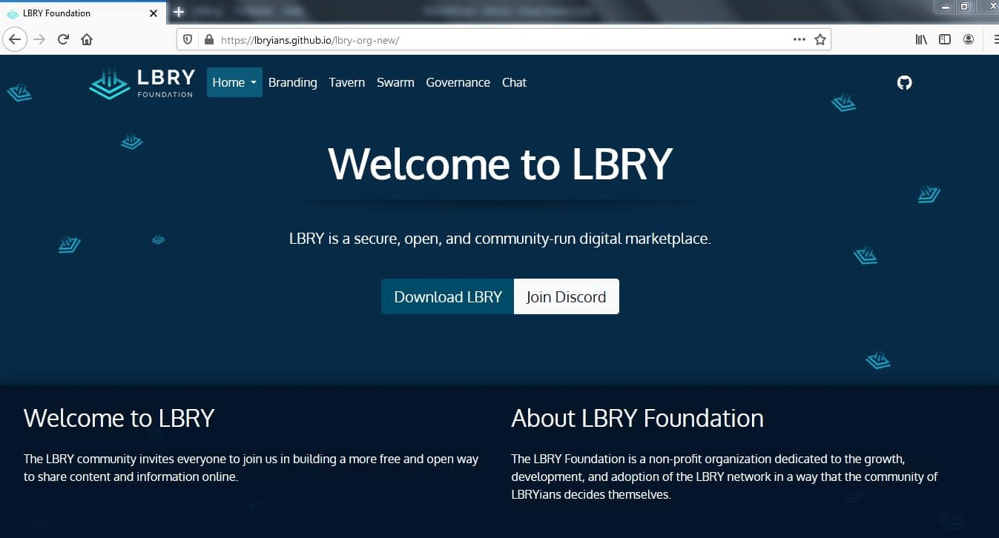

# [LBRY Foundation Website](https://lbry.org)

(under devlopment)
 **The LBRY Foundation is a non-profit organization dedicated to the growth, development, and adoption of the LBRY network in a way that the community of LBRYians decides themselves**

## Prerequisites
- [Git](https://git-scm.com)
- [Jekyll](https://jekyllrb.com)
- A Text editor or any code editor (E.g - [Visual Studio Code](https://code.visualstudio.com/download) or [Atom](https://atom.io))
- Web Browser (Please don't use IE)

## Development
1. Fork this repo.
2. Clone your fork locally.
3. This website uses [Jekyll](https://jekyllrb.com/). Read the [Jekyll Docs](https://jekyllrb.com/docs/) to develop locally.

## Usage
Visit [LBRY Foundation](https://lbryians.github.io/lbry-org-new/) to see this repo in production.

## Contributing
Contributions to this project are welcome, encouraged, and compensated.

For more details, see [CONTRIBUTING](CONTRIBUTING.md).

## License
This project is MIT licensed. For the full license, see [LICENSE](LICENSE).
